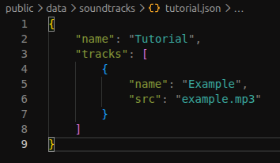

# How to add a new soundtrack:
To add a new soundtrack, make a new folder, in the "public/music" folder.

Inside your music folder, add your song(s), in any format you want (preferably '.mp3' files).

Make a new '.json' file named after your music folder, in the "public/data/soundtracks" folder.

Open the newly-created '.json' file and fill out the details as listed below.

Congratulations! Your soundtrack should now appear in the menu, if you did all the steps correctly.