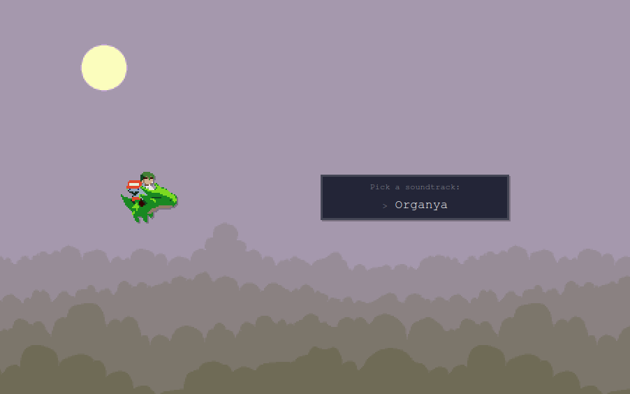
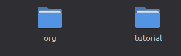
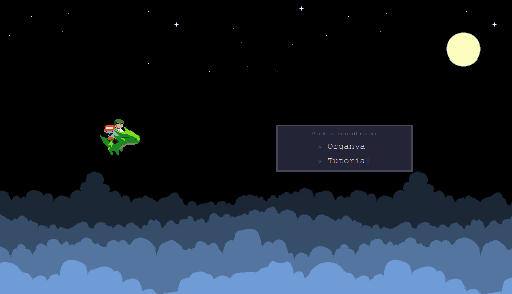

# 1.) Running from Source
To run the app from source, you just need Node (v24.19.0+) & NPM (v11.17.0+).

You can check if you have either Node or NPM installed by running "node --version" or "npm --version," respectively. But this tutorial will assume that you have them installed already.

Inside the folder containing the source, open up the terminal and type "npm install," to install all the dependencies needed. Next, type "npm run start" to actually start running the app. That's basically it, you're all set, after that.

# 2.) How To Add a Custom Album
To add a new album, make a new folder, in the "assets/music" folder.

Inside your music folder, add your song(s), in any format you want (preferably ".mp3" files).

Make a new ".json" file named after your music folder, in the "assets/data/albums" folder.

Open the newly-created ".json" file and fill out the details as listed below.

Congratulations! Your album should now appear in the menu, if you did all the steps correctly.

